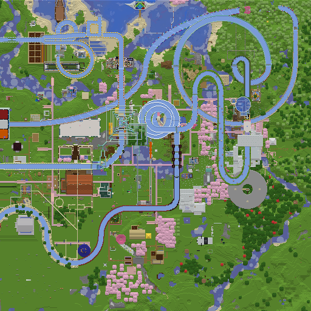
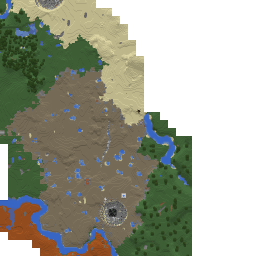
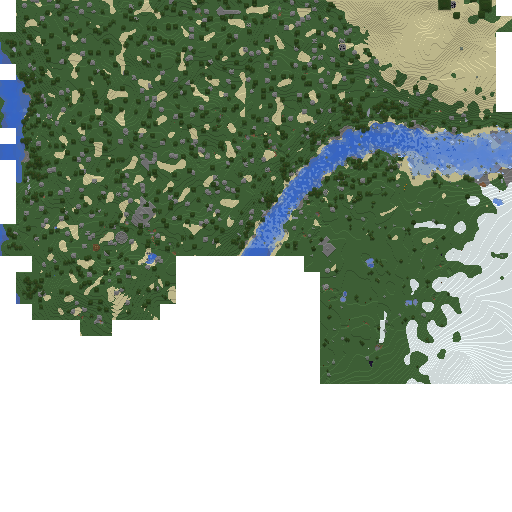

# mcmap - Minecraft Map Renderer and Analysis Tool

Fast command-line tool for rendering Minecraft region files and analyzing block usage.

## Installation

### Download Pre-built Binaries

Download the latest release for your platform from [GitHub Releases](https://github.com/xyqyear/mcmap/releases):

### Build from Source

```bash
cargo build --release
```

## Quick Start

```bash
# Render a map (using block colors)
mcmap render --region r.0.0.mca --palette palette.json --output map.png

# Analyze blocks
mcmap analyze --region /world/region --palette palette.json --show-counts

# Generate palette from Minecraft JAR (and optionally mod jars).
# Pre-1.13 worlds also pass --level-dat; the variant is auto-detected.
mcmap gen-palette -p /path/to/1.20.1.jar --output palette.json
```

## JSON output mode

Every subcommand accepts a global `--json` flag that swaps the human log
output for newline-delimited JSON events on stdout — one event per line,
progress events streamed live and a terminal `result` (or `error`) at the
end. Intended for wrappers, UIs, and CI pipelines that want to follow
progress or capture structured summaries.

```bash
mcmap --json render -r /world/region -p palette.json -o map.png
```

See [`JSON_OUTPUT.md`](./JSON_OUTPUT.md) for the full schema — event
shapes, phase identifiers, counter fields, and exit-code behavior.

## Output ownership (`--chown`)

Global `--chown <OWNER[:GROUP]>` flag (Unix only, requires effective uid
0) chowns every file or directory the run creates or atomically
replaces: the `--split` output dir and rendered PNGs, palette JSON
outputs, downloaded client jars, and the `.mca` / `.mcc` files written
by `replace-chunks` / `remove-chunks`. Useful when running mcmap as
root inside a service or container so the resulting artifacts are
owned by the unprivileged caller.

Accepted forms mirror `chown(1)`. Each part may be a numeric id or a
name resolved through NSS (`getpwnam_r` / `getgrnam_r`):

```bash
# Owner and group by name
sudo mcmap --chown alice:users render -r /world/region -p palette.json -o ./tiles --split

# Numeric ids
sudo mcmap --chown 1000:1000 gen-palette -p 1.20.1.jar -o palette.json

# Group only (name or id)
sudo mcmap --chown :minecraft download-client 1.20.1 ./client.jar
```

A failed chown aborts the command (the requested ownership is not best
effort). The flag is rejected at startup on non-Unix and when not run
as root. The download-client `.jar.part` cache in the system temp dir
is intentionally left alone so it stays reusable across runs.

## Examples







## Commands

### `render` - Render region files to PNG maps

- Supports **1.13+** chunk format (fastanvil), **1.7.10** (with optional NotEnoughIDs extended block IDs), and **Forge 1.12.2** (with RoughlyEnoughIDs / JustEnoughIDs per-section palette format)
- Auto-detects the palette format — modern palette routes through the 1.13+ pipeline, `"format":"1.7.10"` triggers the 1.7.10 legacy path, `"format":"1.12.2"` triggers the REI/JEID legacy path
- Parallel processing for multiple regions

```bash
# Basic rendering
mcmap render -r region.mca -p palette.json -o map.png

# Combine multiple sources — repeat -r for each folder or .mca file.
# Duplicate coordinates across inputs are deduplicated (last wins).
mcmap render -r /world/region -r /overrides/r.0.0.mca -p palette.json -o map.png

# Split mode: save each region as its own PNG inside a directory
# (names mirror the region's .mca file, e.g. r.0.0.mca -> r.0.0.png)
mcmap render -r /world/region -p palette.json -o ./tiles --split

# Copy each source .mca's mtime onto its PNG (only with --split).
# Useful for incremental re-renders driven by file mtimes.
mcmap render -r /world/region -p palette.json -o ./tiles --split --preserve-mtime
```

### `analyze` - Find unknown blocks

- Scans regions to identify all blocks
- Compares against palette to find missing blocks
- Shows occurrence counts

```bash
# Find unknown blocks
mcmap analyze -r /world/region -p palette.json

# Show counts
mcmap analyze -r /world/region -p palette.json --show-counts
```

### `gen-palette` - Generate block → color palette

One command. The target Minecraft version is **auto-detected** from the world's `level.dat`:

- `FML.Registries.minecraft:blocks` present → **Forge 1.12.2** (REI / JEID). Reads the registry, then runs the blockstate-aware resolver against the mod jars (1.12.2 already ships blockstate/model JSONs) alongside a hand-curated vanilla table.
- `FML.ItemData` present → **Forge 1.7.10** (optionally NEID). Reads the registry; uses a hand-curated vanilla `(name, meta) → texture` table; modded blocks fall back to filename matching (1.7.10 has no blockstate JSONs).
- otherwise (or no `level.dat` passed) → **1.13+ (modern)**. Walks blockstate/model/texture JSONs inside the supplied packs.

`--level-dat` is **required** for pre-1.13 worlds and **ignored** for 1.13+. Pass it unconditionally if you have it — scripts that handle multiple versions don't need to branch.

Common traits across all three:

- Reads from `.jar` / `.zip` packs directly — no extraction step.
- Multiple packs layer, first-listed wins on conflict (list custom resource packs first, vanilla last).
- Recurses into `META-INF/jarjar/*.jar` (Forge's Jar-in-Jar bundling).
- `--overrides <FILE>` applies last, beating every automatic tier. Key shape depends on the detected variant: `"ns:name"` for modern; `"id"` / `"id|meta"` for legacy / forge112.
- Transparent pixels are skipped when averaging RGB so sparse textures (vines, fences, crops, rails) keep their real color instead of being pulled toward black.

The output palette's top-level shape tells `render` which chunk codec to use: flat `{"ns:name": [r,g,b,a]}` ⇒ modern; wrapped `{"format":"1.7.10" | "1.12.2", "blocks": {...}}` ⇒ legacy (with the format tag distinguishing the two on-disk chunk shapes).

#### Modern (1.13+) resolution tiers

(First success wins per blockstate.)

1. Render the top face of the block's model (`fastanvil` renderer).
2. Raw-model fallback: any face (`up`→`down`→sides) from the variant's model, from any other variant of the same block (preferring `upper`/`top` keys for tall plants and double slabs), or from the first `apply` model of a multipart blockstate.
3. Regex rewrites — generic patterns (`*:*_fence` → `*:block/*_planks`, same for walls and fence gates) apply across any namespace; hardcoded vanilla quirks (crops at final stage, `fire_0`, `bamboo_stalk`) apply to `minecraft:` only.
4. Texture-path probe — direct lookup of `<ns>:block/<name>`.
5. Substring / generic-blockstate bridges for custom state mappers and dynamically-registered block families.
6. User overrides (`--overrides`) — final authoritative precedence.

Typical vanilla JAR locations:

- Linux: `~/.minecraft/versions/1.20.1/1.20.1.jar`
- Windows: `%APPDATA%\.minecraft\versions\1.20.1\1.20.1.jar`
- macOS: `~/Library/Application Support/minecraft/versions/1.20.1/1.20.1.jar`

#### 1.7.10 (Forge, optionally NEID)

1. Reads the FML block registry from `level.dat` (`FML.ItemData`; numeric id → `namespace:name`, world-specific and assigned at first world generation).
2. For each registered block:
   - If `minecraft:*`, looks it up in a hand-curated `(name, meta) → texture_path` table covering the 100+ common 1.7.10 terrain blocks (shared with the 1.12.2 path under `src/commands/gen_palette/shared/vanilla_1x.rs`).
   - Otherwise, filename-matches the local name against `assets/<namespace>/textures/blocks/*.png` in the mod jars (exact → case-insensitive → stripped-prefix → fuzzy substring).
3. Averages the resolved texture, applies vanilla biome tints (grass/leaves/vines) + water/lava/air overrides, emits a JSON palette keyed by `"id|meta"` or bare `"id"`.

NotEnoughIDs chunks (with `Blocks16` / `Data16` for 16-bit ids) are handled transparently by the renderer — no flag needed.

#### Forge 1.12.2 + REI / JEID

[RoughlyEnoughIDs](https://github.com/MineCrak/RoughlyEnoughIDs) (REI) and its predecessor [JustEnoughIDs](https://github.com/DimensionalDevelopment/JustEnoughIDs) (JEID) write a per-section block-state palette into each chunk and lift the 4096 numeric block-id ceiling to `Integer.MAX_VALUE - 1`. The on-disk shape is partway between vanilla 1.7.10 and 1.13+ — see [`docs/forge_1_12_2_rei.md`](./docs/forge_1_12_2_rei.md) for the full spec.

1. Reads the modern FML registry (`FML.Registries.minecraft:blocks.ids`) from `level.dat`.
2. Vanilla (`minecraft:*`) blocks reuse the shared `(name, meta) → texture` table. Texture filenames under `assets/minecraft/textures/blocks/` are stable between 1.7.10 and 1.12.2; the lookup probes both `block/` and `blocks/` forms automatically.
3. Modded blocks run the modern blockstate-aware resolver (same code as the 1.13+ path). Forge's `forge_marker: 1` blockstate format is recognized — the default model is extracted and resolved through the parent chain alongside standard blockstates.
4. Applies vanilla biome tints (grass, leaves, vines) + special blocks (water/lava/air) keyed by registered name.
5. Emits `{"format":"1.12.2", "blocks": {"id": [r,g,b,a], "id|meta": [r,g,b,a], ...}}`. The `render` command auto-routes to the REI chunk decoder.

#### Examples

```bash
# 1.20.1 vanilla — no level.dat needed
mcmap gen-palette -p ~/.minecraft/versions/1.20.1/1.20.1.jar -o palette.json

# 1.20.1 vanilla + a mod jar
mcmap gen-palette \
  -p create-0.5.jar \
  -p ~/.minecraft/versions/1.20.1/1.20.1.jar \
  -o palette.json

# Point at a server's mods directory (every .jar inside is loaded)
mcmap gen-palette -p ./server/mods -p 1.20.1.jar -o palette.json

# 1.7.10 (GTNH) — auto-detected from level.dat
mcmap gen-palette \
    --level-dat /path/to/gtnh-world/level.dat \
    --pack ~/.minecraft/versions/'GT New Horizons'/mods \
    --pack ~/.minecraft/versions/'GT New Horizons'/1.7.10.jar \
    --output gtnh-palette.json

# Forge 1.12.2 + REI (Nova-style modpack)
mcmap gen-palette \
    --level-dat /path/to/world/level.dat \
    --pack /path/to/modpack/mods \
    --pack /path/to/modpack/1.12.2.jar \
    --output nova-palette.json

# Same flat command works for any version — pass --level-dat blindly:
mcmap gen-palette --level-dat <world>/level.dat --pack <packs...> -o palette.json
```

Mod block → texture matching is best-effort for legacy (1.7.10) — many modded blocks with non-obvious internal names (GregTech machines, Thaumcraft runic blocks) fall back to a generic gray. Use `--overrides` with a `{"id|meta": [r,g,b,a]}` JSON to pin specific blocks manually.

### `replace-chunks` - Copy chunks from one region into another

Byte-level chunk replacement between two `r.X.Z.mca` files. Compressed payloads are passed through verbatim — NBT is never decoded — so DataVersion, mod-specific tags, and modded block data are preserved exactly. The 1.15+ `.mcc` external-chunk overflow mechanism is fully supported: external slots are detected via the scheme byte's high bit, the companion `c.<absX>.<absZ>.mcc` is read from the source's directory and written next to the target.

Useful as a building block for partial chunk rollback, structure transplant, or world splicing. One invocation handles one `.mca` pair; for a 1.17+ world, run it three times — once each for `region/`, `entities/`, and `poi/`.

```bash
# Roll back a single chunk from a backup
mcmap replace-chunks \
    -s backup/region/r.7.-1.mca \
    -t world/region/r.7.-1.mca \
    -c 4,15

# Multiple chunks in one go (semicolon-separated, region-relative coords in [0, 31])
mcmap replace-chunks \
    -s backup/region/r.7.-1.mca \
    -t world/region/r.7.-1.mca \
    -c "4,15;4,14;13,22"

# Source and target with different region coords also works — the slot index is
# region-relative, so (0,0) of source goes to (0,0) of target regardless of rx/rz.
mcmap replace-chunks -s template/r.0.0.mca -t world/region/r.7.-1.mca -c 0,0
```

For a full chunk rollback on a 1.17+ world, mirror the call across the file split:

```bash
for sub in region entities poi; do
    mcmap replace-chunks \
        -s "backup/$sub/r.7.-1.mca" \
        -t "world/$sub/r.7.-1.mca"  \
        -c "4,15;4,14"
done
```

Atomicity ordering on the target side: new `.mcc` files are written via `<file>.tmp` + rename, then the target `.mca` is atomic-renamed, then stale `.mcc` files are deleted. At no point does the on-disk state contain a stub record without its `.mcc`. See [`docs/replace_chunks.md`](./docs/replace_chunks.md) for the format spec, behavior matrix, and atomicity argument.

### `extract-ftb-claims` - Extract FTB chunk-claim data

Reads FTB Utilities / FTB Chunks claim data out of a server world directory and emits a unified JSON document with teams, members, claims, and the on-disk dim folder for each claimed dimension. Designed to feed map-overlay tooling — every claim references a dim id that joins to a `dimensions[]` lookup table giving the parent of `region/`.

Auto-detects four FTB on-disk formats (override with `--format`):

- `snbt` — 1.16+ FTB Chunks/Teams (plain SNBT files under `ftbchunks/` + `ftbteams/`)
- `per-team-nbt` — 1.7.10 GTNH ServerUtilities + 1.12.2 FTB Utilities (gzipped NBT, one file per team)
- `universe-dat` — 1.10.2 FTB Utilities 3.x (single packed `data/ftb_lib/universe.dat`)
- `latmod-json` — 1.7.10 upstream FTBU (`LatMod/ClaimedChunks.json`)

For pre-1.13 dim ids, the resolver tries `DIM<N>/region/` first and then probes for mod-renamed folders (`DIM_MOTHERSHIP<N>`, `PERSONAL_DIM_<N>`, `UW_GARDEN_<N>`, `DIM_MYST<N>`, etc.) so claims map to the correct overlay even on Galacticraft / Dimensional Doors / Mystcraft worlds.

```bash
# Modern 1.16+ world, auto-detect, pretty JSON to stdout
mcmap extract-ftb-claims --world /opt/srv/atm9/world

# Write to a file instead of stdout
mcmap extract-ftb-claims --world /opt/srv/atm9/world -o claims.json

# Mixed-layout 1.7.10 world: force the legacy LatMod reader
mcmap extract-ftb-claims --world /opt/srv/gtnh/world --format latmod-json -o legacy.json

# NDJSON event stream (the full data is embedded in the result event)
mcmap --json extract-ftb-claims --world /opt/srv/atm9/world
```

See [`docs/extract_ftb_claims.md`](./docs/extract_ftb_claims.md) for the full output schema, dim-folder rules, format-family details, and edge cases.

### `remove-chunks` - Empty chunks from a region

Empties the named slots in a target `.mca`. If a slot was external, its companion `c.<absX>.<absZ>.mcc` file is also deleted. Slots not listed are preserved verbatim, including their `.mcc` files. Same byte-level model as `replace-chunks` — no NBT decoding.

```bash
# Remove three chunks
mcmap remove-chunks -t world/region/r.7.-1.mca -c "4,15;4,14;13,22"
```

For a full per-chunk wipe on a 1.17+ world, mirror across the file split the same way as `replace-chunks`.

## Performance

Performance benchmarks on a 512×512 region:

- **Render**: ~470ms (includes block color lookup)

## License

This project uses `fastanvil` and `fastnbt` libraries for Minecraft data processing.

Some code in this project is adapted from the [fastnbt](https://github.com/owengage/fastnbt) project.
