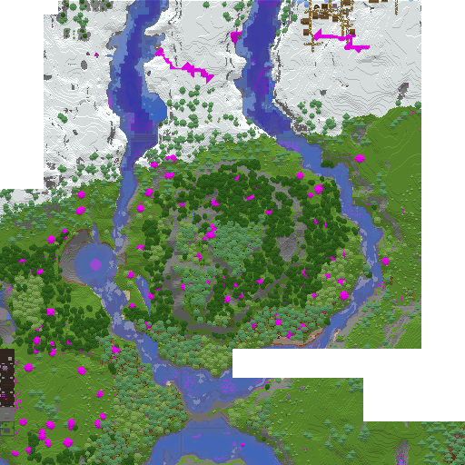
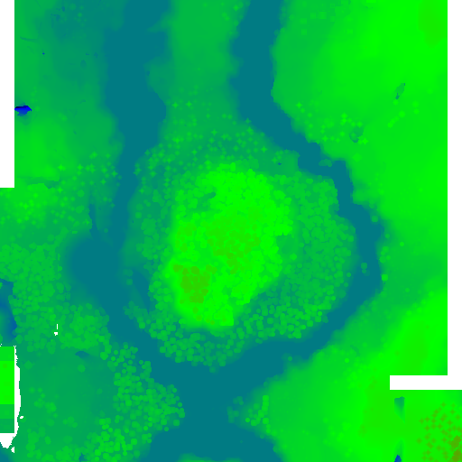

# mcmap - Minecraft Map Renderer and Analysis Tool

Fast command-line tool for rendering Minecraft region files and analyzing block usage.

## Installation

### Download Pre-built Binaries

Download the latest release for your platform from [GitHub Releases](https://github.com/xyqyear/mcmap/releases):

### Build from Source

```bash
cargo build --release
```

## Quick Start

```bash
# Render a map (using block colors)
mcmap render --region r.0.0.mca --palette palette.json --output map.png

# Render a heightmap (color-coded by elevation)
mcmap heightmap --region r.0.0.mca --output heightmap.png

# Analyze blocks
mcmap analyze --region /world/region --palette palette.json --show-counts

# Generate palette from Minecraft JAR (and optionally mod jars)
mcmap gen-palette -p /path/to/1.20.1.jar --output palette.json
```

## Examples

### Block-colored Render

Renders blocks with their actual colors from the palette:



### Heightmap Visualization

Color-coded by elevation (default gradient: black → blue → green → red):



## Commands

### `render` - Render region files to PNG maps

- Supports **1.13+** chunk format (fastanvil) and **1.7.10** (with optional NotEnoughIDs extended block IDs)
- Auto-detects the palette format — a modern palette routes through the 1.13+ pipeline, a `"format":"1.7.10"` palette triggers the legacy path
- Parallel processing for multiple regions
- Output to file or stdout (for HTTP APIs)

```bash
# Basic rendering
mcmap render -r region.mca -p palette.json -o map.png

# Stdout output (e.g. for Python/HTTP integration)
mcmap render -r region.mca -p palette.json -o -

# Split mode: save each region as its own PNG inside a directory
# (names mirror the region's .mca file, e.g. r.0.0.mca -> r.0.0.png)
mcmap render -r /world/region -p palette.json -o ./tiles --split

# Copy each source .mca's mtime onto its PNG (only with --split).
# Useful for incremental re-renders driven by file mtimes.
mcmap render -r /world/region -p palette.json -o ./tiles --split --preserve-mtime
```

### `heightmap` - Render height-based heatmaps

Generates color-coded elevation maps from region files, where colors represent terrain height.

**Features:**

- Two height modes:
  - **Trust heightmap** (default): Uses pre-computed heightmap data from chunks for fast rendering
  - **Calculate heights** (`--calculate-heights`): Scans all blocks to find surface height (slower but more accurate)
- Linear interpolation between color points for smooth gradients
- Custom color mapping support via JSON
- Parallel processing for multiple regions
- Output to file or stdout

**Default color mapping:**

- `-64` (bedrock level): Black
- `0` (sea level): Blue
- `128`: Green
- `255` (old build height): Red

**Basic usage:**

```bash
# Single region file with default colors
mcmap heightmap -r r.0.0.mca -o heightmap.png

# Entire region directory
mcmap heightmap -r /world/region -o heightmap.png

# Calculate heights instead of trusting heightmap data
mcmap heightmap -r r.0.0.mca -o heightmap.png --calculate-heights

# Output to stdout
mcmap heightmap -r r.0.0.mca -o -
```

**Custom color mapping:**

```bash
# Custom gradient: deep blue (-64) -> cyan (0) -> yellow (128) -> red (255)
mcmap heightmap -r r.0.0.mca -o heightmap.png \
  --colors '[[-64,0,0,139,255],[0,0,255,255,255],[128,255,255,0,255],[255,255,0,0,255]]'
```

Color format: `[[height, r, g, b, a], ...]`

- Each point defines a height and its corresponding RGBA color
- Heights between points use linear interpolation
- Must have at least one color point
- Points are automatically sorted by height

### `analyze` - Find unknown blocks

- Scans regions to identify all blocks
- Compares against palette to find missing blocks
- Shows occurrence counts

```bash
# Find unknown blocks
mcmap analyze -r /world/region -p palette.json

# Show counts
mcmap analyze -r /world/region -p palette.json --show-counts
```

### `gen-palette` - Generate palette from Minecraft and mod jars

- Reads block colors directly from `.jar` / `.zip` resource packs — no extraction step.
- Treats vanilla and mods uniformly: every pack is walked for `assets/<namespace>/{blockstates,models,textures}/...`.
- Multiple packs can be layered, with the first-listed pack winning on conflict (list custom resource packs first, vanilla last).
- Automatically adds missing common blocks (water, air, vine, grass, fern, etc.) and base colors for state variants (for O(1) lookup).

**Resolution tiers** (first success wins per blockstate):

1. Render the top face of the block's model (`fastanvil` renderer).
2. Raw-model fallback: any face (`up`→`down`→sides) from the variant's model, from any other variant of the same block (preferring `upper`/`top` keys for tall plants and double slabs), or from the first `apply` model of a multipart blockstate.
3. Regex rewrites — generic patterns (`*:*_fence` → `*:block/*_planks`, same for walls and fence gates) apply across any namespace; hardcoded vanilla quirks (crops at final stage, `fire_0`, `bamboo_stalk`) apply to `minecraft:` only.
4. Texture-path probe — direct lookup of `<ns>:block/<name>`.
5. User overrides (`--overrides`) — final authoritative precedence.

Transparent pixels are skipped when averaging RGB, so sparse textures (vines, fences, crops, rails) keep their real color instead of being pulled toward black.

**Usage:**

```bash
mcmap gen-palette --pack <PATH>... --output palette.json
    -p <PATH>           repeatable; .jar/.zip file, or directory containing .jar/.zip files
    -o <FILE>           output path (default: palette.json)
    --overrides <FILE>  optional JSON map of `"ns:id"` → `[r,g,b,a]`; applied last
```

Typical vanilla JAR locations:

- Linux: `~/.minecraft/versions/1.20.1/1.20.1.jar`
- Windows: `%APPDATA%\.minecraft\versions\1.20.1\1.20.1.jar`
- macOS: `~/Library/Application Support/minecraft/versions/1.20.1/1.20.1.jar`

**Examples:**

```bash
# Vanilla only
mcmap gen-palette -p ~/.minecraft/versions/1.20.1/1.20.1.jar -o palette.json

# Vanilla + a mod jar (mod blocks appear as `create:cogwheel`, etc.)
mcmap gen-palette \
  -p create-0.5.jar \
  -p ~/.minecraft/versions/1.20.1/1.20.1.jar \
  -o palette.json

# Point at your server's mods directory (every .jar inside is loaded)
mcmap gen-palette -p ./server/mods -p 1.20.1.jar -o palette.json

# Custom resource pack overrides vanilla block colors
mcmap gen-palette -p my_pack.zip -p 1.20.1.jar -o palette.json
```

### `gen-palette-legacy` - Generate palette for pre-1.13 worlds (1.7.10)

1.7.10 has no blockstate/model JSONs — block rendering is hard-coded in Java, so there is no mechanical way to derive a texture from a block name. `gen-palette-legacy` takes a different approach:

1. Reads the FML block registry from the world's `level.dat` (the numeric id → `namespace:name` mapping is world-specific and assigned when the world was first generated).
2. For each registered block:
   - If it's `minecraft:*`, looks it up in a hand-curated `(name, meta) → texture_path` table covering the 100+ common 1.7.10 terrain blocks (see `src/commands/gen_palette_legacy/vanilla.rs`).
   - Otherwise, filename-matches the local name against `assets/<namespace>/textures/blocks/*.png` in the mod jars (exact match, then case-insensitive, then stripped-prefix, then fuzzy substring).
3. Averages the resolved texture, applies vanilla biome tints (grass/leaves/vines) and water/lava overrides, and emits a JSON palette keyed by `"id|meta"` or bare `"id"`.

The output palette is wrapped as `{"format":"1.7.10", "blocks": {...}}` so `render` auto-routes to the legacy codec. NotEnoughIDs chunks (with `Blocks16` / `Data16`) are handled transparently.

**Usage:**

```bash
mcmap gen-palette-legacy \
    --level-dat <WORLD>/level.dat \
    --pack <mods-dir-or-jars>... \
    --pack <1.7.10.jar> \
    --output palette.json
```

**Example (a GTNH world):**

```bash
mcmap gen-palette-legacy \
    --level-dat /path/to/gtnh-world/level.dat \
    --pack ~/.minecraft/versions/'GT New Horizons'/mods \
    --pack ~/.minecraft/versions/'GT New Horizons'/1.7.10.jar \
    --output gtnh-palette.json

mcmap render -r /path/to/gtnh-world/region -p gtnh-palette.json -o map.png
```

Note that mod block → texture matching is best-effort. Many modded blocks with non-obvious internal names (GregTech machines, Thaumcraft runic blocks) will fall back to a generic gray. Use `--overrides` with a `{"id|meta": [r,g,b,a]}` JSON to pin specific blocks manually.

## External Stdout Integration

Both `render` and `heightmap` commands support stdout output for integration with web frameworks and other tools.

```python
import subprocess

# Render block-colored map and get PNG data
result = subprocess.run(
    ["mcmap", "render", "-r", "region.mca", "-p", "palette.json", "-o", "-"],
    stdout=subprocess.PIPE
)
png_data = result.stdout

# Use in Flask/FastAPI
from flask import send_file
from io import BytesIO
return send_file(BytesIO(png_data), mimetype='image/png')
```

## Performance

Performance benchmarks on a 512×512 region:

- **Render**: ~470ms (includes block color lookup)
- **Heightmap** (trust mode): ~210ms (uses existing heightmap data in the region file)
- **Heightmap** (calculate mode): ~330ms (scans all blocks)

## License

This project uses `fastanvil` and `fastnbt` libraries for Minecraft data processing.

Some code in this project is adapted from the [fastnbt](https://github.com/owengage/fastnbt) project.
